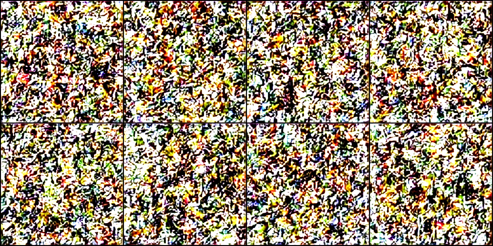
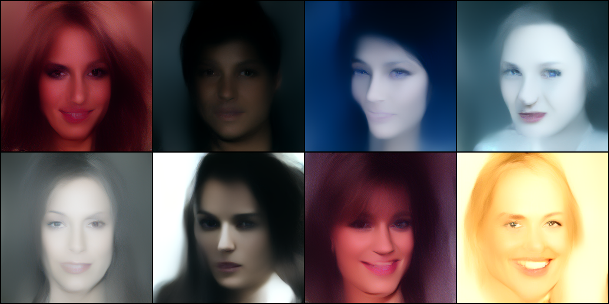
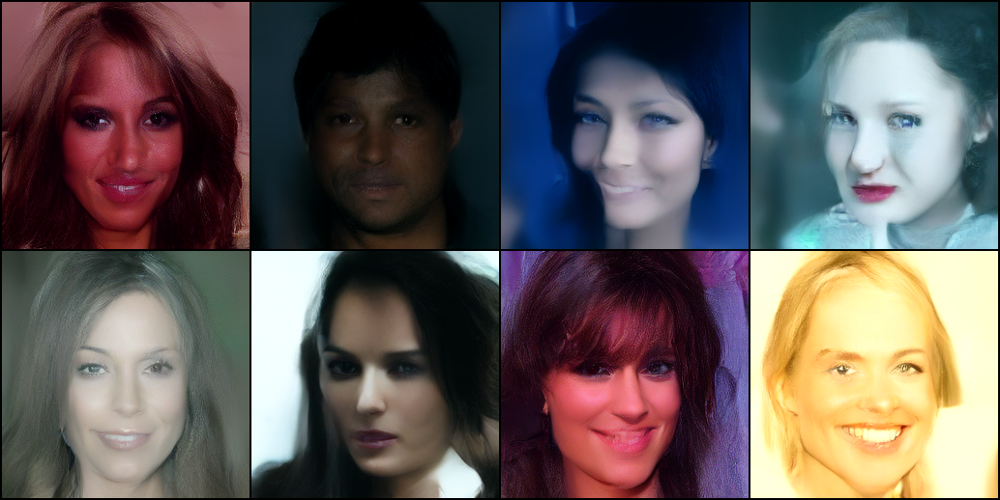
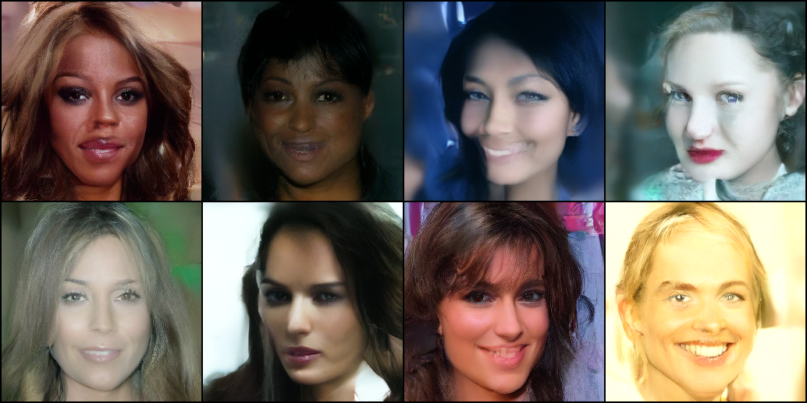

# LDM 复现

[English](README.md)

基于 Rombach et al. (CVPR 2022) **Latent Diffusion Models** 的简化复现：冻结官方 vq-f4，在 CelebA-HQ 256² 的 64×64×3 latent 上训练无条件 U-Net，DDIM 采样后解码。

对应官方配置：[celebahq-ldm-vq-4.yaml](https://github.com/CompVis/latent-diffusion/blob/main/configs/latent-diffusion/celebahq-ldm-vq-4.yaml)（LDM-4）。

代码风格参考 [nanoGPT](https://github.com/karpathy/nanoGPT)：单文件、可读、便于学习与扩展。

**论文：**

- [High-Resolution Image Synthesis with Latent Diffusion Models](https://arxiv.org/abs/2112.10752)

## 功能

- 冻结官方 vq-f4（`encode` 为量化前 z；`decode` 时 codebook 最近邻）
- 前向扩散、L_simple（ε-预测）训练
- DDIM 采样：默认 200 步，η 可调（η=0 确定性，η=1 DDPM 级方差）
- latent U-Net（正弦时间嵌入 + 空间自注意力）
- EMA 权重采样；训练中间出图使用固定噪声
- TensorBoard（loss、速度、采样图、FID）
- FID（相对训练图像，Inception-v3 2048 维）
- CelebA-HQ 自动下载，或本地 ImageFolder

## 项目结构

```
my_LDM/
├── train.py              # 训练 / 采样 / FID（单文件）
├── requirements.txt
├── docs/
│   ├── LDM-note.html     # 论文精读笔记
│   ├── 2112.10752v2.pdf  # 论文原文
│   └── figs/             # 实验采样图
├── models/vq-f4/         # 官方 vq-f4（需手动下载）
├── data/                 # CelebA-HQ ImageFolder（HF 下载后导出）
└── runs/                 # checkpoint、采样图、tensorboard 日志
```

## 环境安装

需要 Python 3.11+，建议使用 NVIDIA GPU（驱动支持 CUDA 12.0+）。

```bash
pip install -r requirements.txt
```

第一阶段权重需单独下载（训练不会自动拉取）：

```bash
mkdir -p models/vq-f4
wget -O models/vq-f4/vq-f4.zip https://ommer-lab.com/files/latent-diffusion/vq-f4.zip
unzip -o models/vq-f4/vq-f4.zip -d models/vq-f4
```

解压后为 `models/vq-f4/model.ckpt`。

## 使用示例

### 训练

`--data_dir` 为 ImageFolder 则直接读取，否则从 Hugging Face 下载并导出到 `data/celebahq/all/`。

```bash
python train.py --vq_ckpt models/vq-f4/model.ckpt \
  --batch_size 8 --lr 1.6e-5 --max_steps 80000 \
  --ddim_steps 50 --n_samples 8 \
  --sample_every 2000 --ckpt_every 10000
```

`lr = 2e-6 × batch`。输出在 `runs/ldm_uncond/`。

### 断点续训

```bash
python train.py --vq_ckpt models/vq-f4/model.ckpt \
  --resume runs/ldm_uncond/ckpt.pt --out runs/ldm_uncond
```

### 采样

`--sample` 使用 EMA 权重，默认 200 步 DDIM、η=0：

```bash
python train.py --sample --ckpt runs/ldm_uncond/ckpt.pt \
  --vq_ckpt models/vq-f4/model.ckpt --out runs/ldm_uncond
python train.py --sample --ckpt runs/ldm_uncond/ckpt.pt \
  --vq_ckpt models/vq-f4/model.ckpt --eta 1.0
```

生成 `samples_final.png` 和 `progression.png`（`--progress_every 10`）。η=0 时同 seed 结果逐像素一致。

### 本地 ImageFolder

```bash
python train.py --vq_ckpt models/vq-f4/model.ckpt --data_dir my_faces
```

目录格式：`root/class_name/*.{jpg,png,webp}`。

### TensorBoard

```bash
tensorboard --logdir runs/ldm_uncond/tb
```

`train/loss`、`train/ms_per_step`、`samples/grid`、`eval/fid`。

### FID 评测

```bash
python train.py --eval_fid --ckpt runs/ldm_uncond/ckpt.pt \
  --vq_ckpt models/vq-f4/model.ckpt --n_fid 5000 --ddim_steps 200
```

训练期间（`--fid_every 0` 关闭）：

```bash
python train.py --vq_ckpt models/vq-f4/model.ckpt --fid_every 20000 --n_fid 1000
python train.py --vq_ckpt models/vq-f4/model.ckpt --fid_final --n_fid 10000
```

## 常用参数

| 参数 | 默认值 | 说明 |
|------|--------|------|
| `--max_steps` | 410000 | 训练步数 |
| `--batch_size` | 48 | batch size |
| `--lr` | 9.6e-5 | AdamW（`2e-6 × batch`） |
| `--dim` | 224 | U-Net 基础通道（约 228M） |
| `--T` | 1000 | 扩散步数 |
| `--ddim_steps` | 200 | DDIM 子序列长度 |
| `--eta` | 0.0 | 0 = 确定性，1 = DDPM 方差 |
| `--sample_every` | 5000 | 每 N 步保存采样图 |
| `--n_fid` | 10000 | FID 生成张数 |
| `--fid_every` | 0 | 每 N 步评 FID（`0` 关闭） |

## 数据集

| 项目 | 本仓库 | 论文 |
|------|--------|------|
| 数据集 | [korexyz/celeba-hq-256x256](https://huggingface.co/datasets/korexyz/celeba-hq-256x256) | taming `CelebAHQTrain` |
| 任务 | 无条件生成 | 无条件生成 |
| 训练数据 | train+val，约 3 万张 | train split |
| 分辨率 | 256×256 RGB | 256×256 RGB |
| latent | 64×64×3（vq-f4） | 同 |
| 预处理 | Resize / CenterCrop，[-1, 1] | resize 256，[-1, 1] |
| 数据增强 | 随机水平翻转 | 随机水平翻转 |
| FID 参考集 | 训练图像（无翻转） | CelebA-HQ 训练集 |

## 实验指标

FID：生成样本与训练图像对比（Inception-v3、2048 维）。EMA + DDIM。硬件：RTX 4090D。本仓库：batch 8，lr 1.6e-5，80k steps，约 220 ms/step。

| 指标 | 本仓库 | 论文 LDM-4 |
|------|--------|------------|
| **FID ↓**（DDIM，η=0） | **21.9**（5k 张，200 步，83.5 min） | **5.11**（200 步） |
| 训练步数 | 80k | 410k |
| Batch size | 8 | 48 |
| U-Net | ~228M | ~274M |

差距来自 U-Net 结构、训练步数与 batch。固定噪声采样：

<p align="center">
  
  
</p>
<p align="center"><em>2k / 20k</em></p>

<p align="center">
  
  
</p>
<p align="center"><em>40k / 80k</em></p>

## 与论文的差异

核心算法与 CelebA-HQ LDM-4 一致（冻结 vq-f4、ε-预测、L_simple、sqrt-space 线性 β、EMA、DDIM）。U-Net 模块树不同，不能加载官方 U-Net 权重。

| 项目 | 本仓库 | 论文 LDM-4 |
|------|--------|------------|
| First-stage | 官方 vq-f4，冻结 | 同 |
| U-Net | ~228M；每层 2 ResBlock，attention / skip 各一次 | ~274M `UNetModel`；每 ResBlock 后 attention，上采样每块 concat |
| 训练步数 | 80k | 410k |
| Batch size | 8 | 48 |
| 优化器 / 学习率 | AdamW，1.6×10⁻⁵ | AdamW，9.6×10⁻⁵ |
| EMA | 0.9999 | 0.9999（LitEma warmup） |
| Dropout | 0.0 | 0.0 |
| T / β | 1000，`linspace(√0.0015, √0.0195)²` | 同 |
| DDIM 子序列 | 分数均匀，η=0 | `range(0,T,T//n)`，η=0 |
| FID 参考 / 规模 | 本仓库训练集，5k 张 | CelebA-HQ train；论文报告 5.11 |

详细笔记见 `docs/LDM-note.html`。

## 引用

```bibtex
@inproceedings{rombach2022high,
  title={High-Resolution Image Synthesis with Latent Diffusion Models},
  author={Rombach, Robin and Blattmann, Andreas and Lorenz, Dominik and Esser, Patrick and Ommer, Bj{\"o}rn},
  booktitle={CVPR},
  year={2022}
}
```
